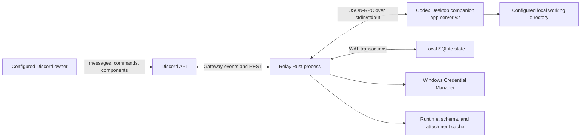

# Relay architecture

Relay is a single-user Discord control plane for the Codex Desktop runtime. The release binary,
Discord bot, state store, command router, and Codex protocol client are one Rust process. Codex
itself runs as a child process in app-server mode.

## System boundary

Relay does **not** call an OpenAI-compatible HTTP bridge. Its `src/codex` module is an embedded,
typed Rust app-server client used only inside Relay. The separately released
[Codex OpenAI Bridge](https://github.com/0rkx/codex-openai-bridge) is not required to install or run
Relay.

## Components

### Discord adapter

`src/discord` uses Serenity for Gateway events, REST calls, embeds, buttons, selects, modals,
autocomplete, attachments, permissions, and guild command registration. It provides:

- one private Discord channel per materialized Codex task;
- control channels for creation, browsing, runner state, and audit events;
- coalesced answer, activity, and plan cards instead of one message per token;
- typed approval and user-input cards for server-initiated requests;
- schema-generated action forms and a GOD-gated raw RPC escape hatch.

Guild command registration is guild-scoped, so setup and command updates do not depend on global
command propagation.

### Embedded Codex client

`src/codex/client.rs` discovers the installed Codex Desktop companion, starts `codex.exe
app-server`, and speaks newline-delimited JSON-RPC over piped standard input and output. It owns
request ID correlation, timeouts, protocol validation, reconnect generation guards, child
shutdown, notifications, and server-initiated requests.

On Windows, Relay prefers the currently installed Store package companion. It hashes and
atomically copies that executable into Relay's private runtime directory before launch because
the original WindowsApps path may be ACL-protected. A previously verified private copy can be
used when Desktop is temporarily unavailable. `CODEX_RELAY_CODEX_EXECUTABLE` is an explicit
advanced override.

At startup, Relay runs Codex app-server schema generation and loads the resulting method metadata.
That live catalog drives capability checks, autocomplete, parameter validation, and coverage
reporting. Codex Desktop can auto-update, so the installed schema—not a hard-coded version
number—is runtime authority.

### Durable state

`src/state.rs` uses SQLite through SQLx with WAL mode and foreign keys enabled. The database tracks:

- task-to-channel mirrors and channel ingestion cursors;
- pending approvals and elicitation requests;
- redacted audit events;
- a deduplicated Discord delivery outbox;
- tasks requiring post-GOD cleanup;
- durable retries for deletion of messages beginning with `!god`.

The outbox prevents a transient Discord failure from losing a completed answer. Rows dead-letter
after ten failed deliveries so one poisoned destination cannot block later work. The runner status
card exposes dead-letter count.

Discord attachments are downloaded before a turn is dispatched. This prevents later replay from
depending on an expiring Discord CDN URL. Each file is limited to 25 MiB. The local cache is pruned
at seven days and around a 512 MiB high-water mark.

### Provisioner and Windows integration

`src/setup.rs` validates the bot token, requires the configured owner to be the Discord server
owner, checks required permissions, provisions the private layout, and stores configuration.
`src/windows.rs` installs the release binary, registers logon startup through Task Scheduler, and
falls back to the current-user Run key if Task Scheduler policy denies registration.

PowerShell scripts are bootstrap and removal wrappers. Runtime behavior remains in the Rust
binary. Windows system tools are used for OS-native startup registration, process inspection, and
ACL management.

## Event flow

1. Owner posts text or an attachment in a task channel, or uses a slash command/component.
2. Relay verifies guild, owner, channel privacy, task binding, and action policy.
3. Relay converts the interaction to typed app-server parameters and sends one JSON-RPC request.
4. Codex notifications update coalesced plan, activity, and answer state.
5. Approval or elicitation requests become owner-bound Discord components or modals.
6. Final answer is written through the durable outbox and the task channel moves to its new state.
7. If the relay was offline, it scans from the stored channel cursor and replays unprocessed owner
   messages in order.

## Concurrency and failure behavior

- Tokio tasks separate Discord Gateway handling, Codex reads, stream flushing, outbox delivery,
  sensitive-message deletion, and GOD expiry.
- Codex request IDs are correlated through one process generation; a connection loss fails
  pending work and permits a fresh child to initialize.
- Task ingestion locks prevent the same channel from being replayed concurrently.
- GOD lifecycle guards prevent activation, expiry, revocation, and privileged dispatch from
  crossing each other. A task stays quarantined until permissions are normalized after GOD use.
- A lagged Codex notification receiver is logged. A lagged server-request receiver is also audited
  because a dropped approval could leave a turn waiting; interrupt the affected task if this alert
  appears. This is a known operational limit, not a durability guarantee for that in-memory queue.

## Scope boundaries

- Multi-user or multi-tenant Discord operation.
- Creating a Discord application or server through the Discord API.
- Replacing Codex Desktop authentication with an OpenAI API key.
- Exposing Relay itself as an OpenAI-compatible HTTP API.
- ChatGPT token refresh and device attestation are not advertised as host capabilities. Dynamic
  client-side tools are limited to Relay's explicit read-only Rust HostBroker allowlist.

See [SECURITY.md](SECURITY.md) for trust boundaries and [COVERAGE.md](COVERAGE.md) for precise
coverage terminology.
